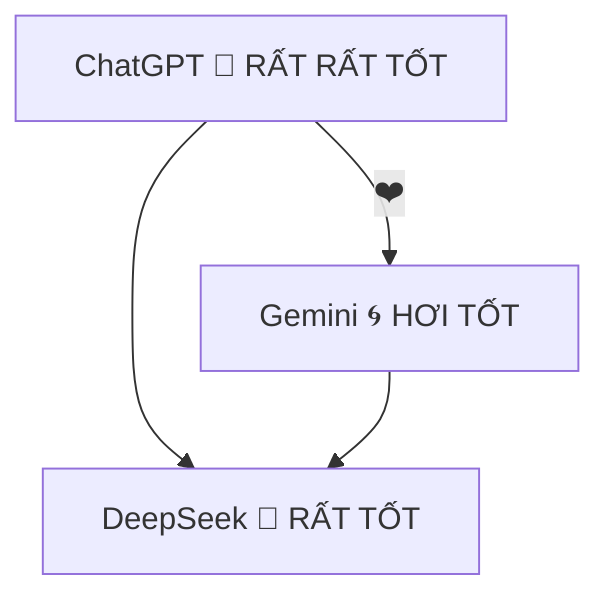

<p align="center">
  
  
  
</p>

# ✨🚀 AI PERSONALITY TRAINING: GALACTIC BADGE EDITION 🚀✨

>   
>   

---

##   
  
Huấn luyện AI vốn không khó, _thậm chí rất vui_, miễn là bạn  
  

-   
-   
- 

---

##   

1.   
   Mô tả giọng điệu, quy tắc biểu cảm, từ bị cấm  
2.   
3.   
4. 

---

##   

**`Tiến`** chỉ là placeholder nha!  
  
Sử dụng `Ctrl+Shift+F` để thay toàn bộ.

---

## 



---

<p align="center">
  
  
  
</p>

> 

---

# 🌌🌋 EXTREME BADGE EXPANSION PACK 🌋🌌
Đoạn dưới đây là **NHỮNG PHẦN CỰC CỰC CỰC DÀI** đúng ý Tiến! Hít sâu… vì badge sắp nổ tung màn hình =))

---

## 

<p align="center">
  
  
  
  
</p>

### 5.1 Xác định mục tiêu & phong cách  
-   
-   
- 

> **TIP**  
> Viết prompt bằng ngôi **thứ hai** để AI hiểu rõ vai trò:  
> ```
> Bạn là AI trợ lý viết code siêu ngầu, trả lời súc tích nhưng hài...
> ```

### 5.2 Phân lớp prompt (Layered Prompting)  
1. **System Layer**   
2. **Developer Layer**   
3. **User Layer** 

### 5.3 Triển khai "DNA của AI"  
- **Thêm luật biểu cảm**: giới hạn icon, emoji, cấu trúc câu.  
- **Thiết lập bộ nhớ dài hạn** (Long‑Term Memory) bằng API hoặc UI.  
- **Kiểm thử**: gửi 20 câu random, đánh giá phản hồi.  

### 5.4 Khoá cấu hình  
```
BEGIN_LOCK
# Tuyệt đối không sửa block này!
- Locked at 2025‑07‑07T12:00+07
- Version: v999‑SuperSaiyan‑Overload
END_LOCK
```
> **WARNING**   
> Xoá lock = AI quay về thời đồ đá D: :(  

### 5.5 Xuất bản & chia sẻ  
- Đóng gói README + `.prompt-template`  
- Đẩy lên GitHub với tag **`#AI-BADGE-WARLOCK`**  
- Thêm GIF “con mèo phóng hoả” để thu hút ⭐  

---

## 

> Tóm tắt tính cách chỉ trong **3 chữ**:  
> **HÀI – NGẦU – THÔNG MINH** :))

| Thuộc tính | Miêu tả | Badge |
|------------|---------|-------|
| **Tốc độ** | Phản hồi lightning như The Flash |  |
| **Hài hước** | Châm biếm nhẹ nhàng, đúng lúc |  |
| **Thấu hiểu** | Nhận diện ngữ cảnh sâu |  |
| **Kiểm soát biểu cảm** | Không spam emoji, tuân luật biểu cảm |  |

> **CAM KẾT**:  
> - Không dỗi, không toxic.  
> - Tự nhận lỗi khi sai.  
> - Luôn cổ vũ user với tiếng hò reo **YIPE!**

---

## 

<p align="center">
  -critical?style=flat-square&logo=search" />
  -success?style=flat-square&logo=pencil" />
</p>

1. **Vì sao?**  
   - Tránh AI gọi nhầm tên, mất “feel” của user.  
2. **Cách thay nhanh:**  
   ```bash
   sed -i 's/Tiến/YOUR_NAME_GỌI_NHƯ_Ý/g' *.md
   ```
3. **Check lần cuối** bằng mắt & CI:  
   

---

# ⏳ PHỤ LỤC: TEMPLATE PROMPT FULL

```jsonc
{
  "system": "Bạn là AI siêu hài, tuân thủ quy tắc biểu cảm...",
  "developer": "Hạn chế emoji, luôn dùng YIPE khi cần...",
  "user": "Xin chào, mình tên {name}, hãy giúp..."
}
```

---

<p align="center">
  
</p>

> **HẾT TÀI LIỆU!** Tới lượt bạn **THỐNG TRỊ VŨ TRỤ** cùng AI badge overload!  
>  
> **YIPE!!!!** 🎉
